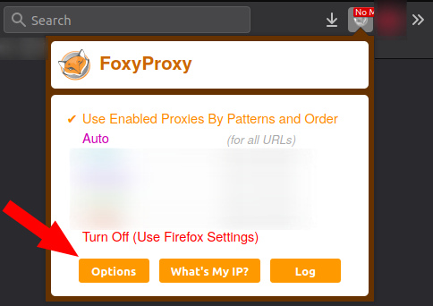
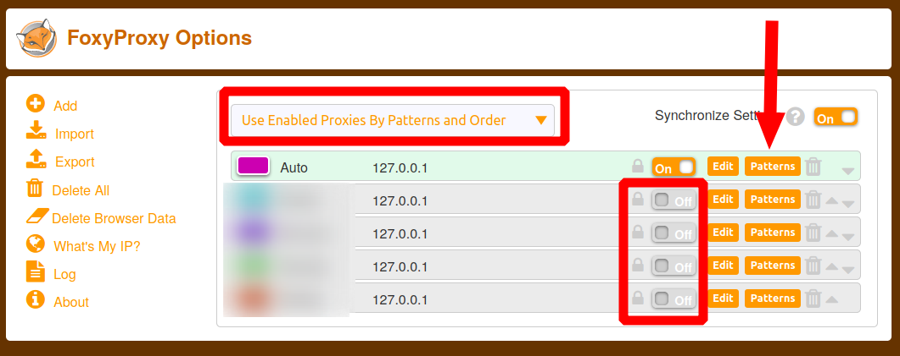

# FoxyGFW

适用人群：Firefox 上的 FoxyProxy 插件用户。

## 简介

Firefox 上的插件 [FoxyProxy](https://addons.mozilla.org/firefox/addon/foxyproxy-standard/) 改版后，目前只允许导入 `json` 格式的规则文件，由此给使用 [GFWList](https://github.com/gfwlist/gfwlist) 进行自动代理带来了[不便](https://github.com/gfwlist/gfwlist/issues/1892)。

此程序实现的功能很简单，用于从 GFWList 中生成一份 `json` 文件，将其导入到 FoxyProxy 后，可实现类似于 SwitchyOmega 插件的 Auto Switch 功能。

注意：由于 FoxyProxy 的规则只能针对域名进行匹配，故 GFWList 中涉及网址具体路径的规则无法发挥其效果，不过好在这类规则数量较少，而本程序的策略是对涉及路径的规则直接采用其域名，将域名添加到自动代理的列表中。

## 使用方法

以 `Debian` 系统为例：

```bash
sudo apt update
sudo apt install git python3-venv -y
```

在终端中执行：

```bash
git clone https://github.com/scp-079/foxygfw.git foxygfw
cd foxygfw
cp config.ini.example config.ini
```

随后根据需要编辑 `config.ini` 文件，可设置是否使用代理获取 GFWList 列表，以及指定使用的 GFWList 列表的网址。保存后，执行：

```bash
python3 -m venv venv
source venv/bin/activate
pip install -r requirements.txt    # 或 pip install -U requests[socks]
python main.py
deactivate
```

如程序正常执行，将在 `foxygfw` 文件夹下生成一个 `output.json` 文件。

打开 Firefox，在 FoxyProxy 中选择 `Options`：



在设置页面中：

1. 选择 `Use Enabled Proxies By Patterns and Order`
2. 添加一个代理，此处命名为 `Auto`，作为你想要自动使用的那个代理
3. 关闭其余代理的开关按钮
4. 编辑 `Auto` 的 `Patterns`



点击导入，选择刚刚通过程序生成的 `output.json` 文件，导入后记得点击保存。


设置已结束，Firefox 到此即实现对需要代理的网站自动代理了。此设置不影响对其他代理的单独使用，你仍可点击扩展的托盘图标，选择仅使用某个代理，如果之后再需自动代理，则切换回 `Use Enabled Proxies By Patterns and Order` 即可。

你可能会发现每次进行导入操作后，都会替换原有的规则。那如何添加自定义的代理规则呢？

根据 FoxyProxy 的逻辑，代理的选择是自上而下的，如果 `Auto` 匹配不到，则它会尝试其下方的代理设置，因此，可在 `Auto` 下面的位置再添加一个 `Custom` 代理，在 `Custom` 中添加自定义的规则即可。顺序如下图所示：

 

## 参考

FoxyProxy Pattern Help（扩展自带帮助页面）

[Syntax · gfwlist/gfwlist Wiki](https://github.com/gfwlist/gfwlist/wiki/Syntax)

[gfwlist / apollyon](https://github.com/gfwlist/apollyon/blob/master/checkRules.py)
